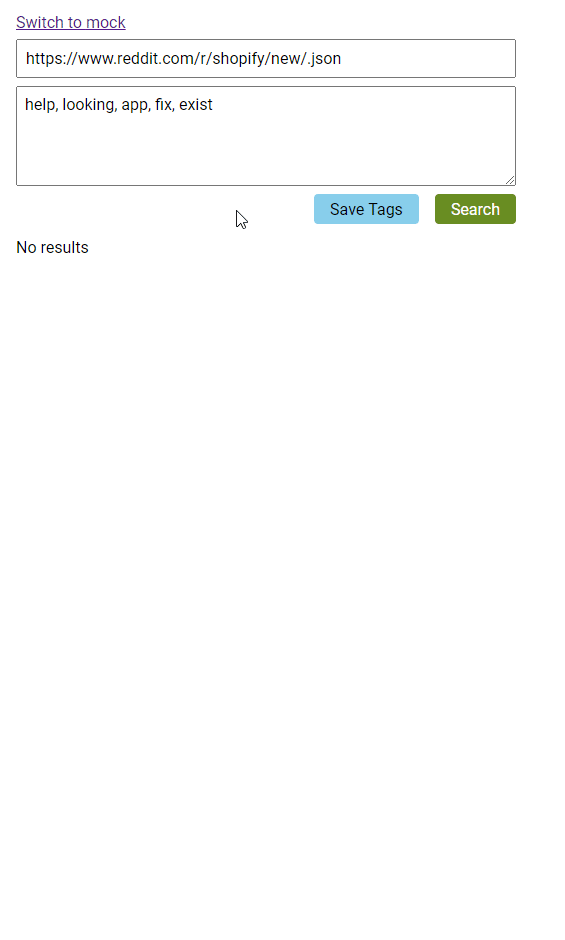
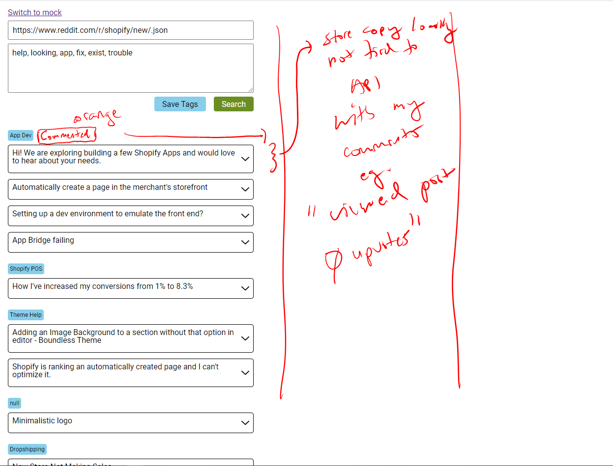

### About

This is a basic subreddit viewer for research, it is basic and just uses the basic "add `.json` to a url to turn a sub into a `JSON` dump".
So this will only ever fetch 25 posts from the url pasted in, which is fine for me since I just look at this at best once a day.

This tool allows you to view the title, body, some insight eg. age/interest on the post and then ability to view the post directly(url).
Also you can comment on posts/store them locally for future reference.

This is all using `localStorage` so it's all in your browser.

### Apologies

This has no structure right now eg. "one file" just making it as I go along

### Demo

### Upcoming work/feature

### How to use

You can just clone/run this app off of port `:3000` or you can do `npm run build` to generate static files and host them somewhere, personally I have this on a local Raspberry Pi web server. You can intercept your computer's requests eg. `/etc/hosts` to trick intercept some custom domain request to go to your local Pi but I'm not doing that.

This project was bootstrapped with [Create React App](https://github.com/facebook/create-react-app).

Icons sourced from [UXWing](https://uxwing.com/) and [Flaticon](https://www.flaticon.com/)